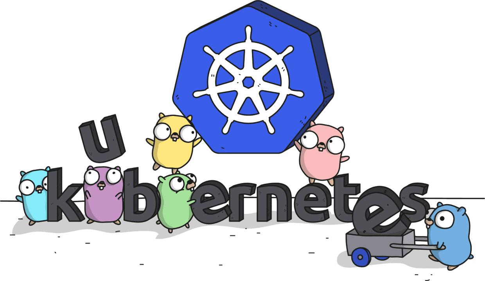

# Kratos

A example Kubernetes operator created using dynamic client to create Kubernetes cluster on DigitalOcean.
Once the operator is running, and we create a Kratos K8S resource in a cluster, a DigitalOcean Kubernetes
cluster would be created with provided configuration.

**Dynamic Client simplifies the process of talking to a Kubernetes cluster by dynamically adapting to what's available and making it easier for you to work with different types of objects without writing a ton of specific code. Using a GVR, we have created a dynamic client to talk to DigitalOcean Kubernetes cluster.**

Here is an example of the Kratos resource

```
apiVersion: rishabh.dev/v1alpha1
kind: Kratos
metadata:
  name: kratos-1
spec:
  name: kratos-1
  region: "nyc1"
  version: "1.28.2-do.0"
  tokenSecret: "default/dosecret"
  nodePools:
    - count: "4"
      name: "dummy-nodepool"
      size: "s-2vcpu-2gb"
```

# Deploy on a Kubernetes cluster

Execute below command, from root of the repo

Create Kratos CRD

```
kubectl create -f manifests/rishabh.dev_kratos.yaml
```

Create RBAC resources and deployment

```
kubectl create -f installation/
```

# Create a secret with DigitalOcean token

To call DigitalOcean APIs we will have to create a secret with DigitalOcean token that
will be used in the Kratos CR that we create.

```
kubectl create secret generic dosecret --from-literal token=<your-DO-token>
```

# Add DigitalOcean token to the env

### Required to call delete cluster API

```
export DIGITAL_OCEAN_TOKEN=<your-DO-token>
```

# Create a Kratos CR

Create the Kratos resource to create a k8s cluster in DigitalOcean

```
kubectl create -f manifests/kratosone.yaml
```

# Delete a Kratos CR

Delete the Kratos resource to delete the k8s cluster in DigitalOcean

```
kubectl delete -f manifests/kratosone.yaml
```